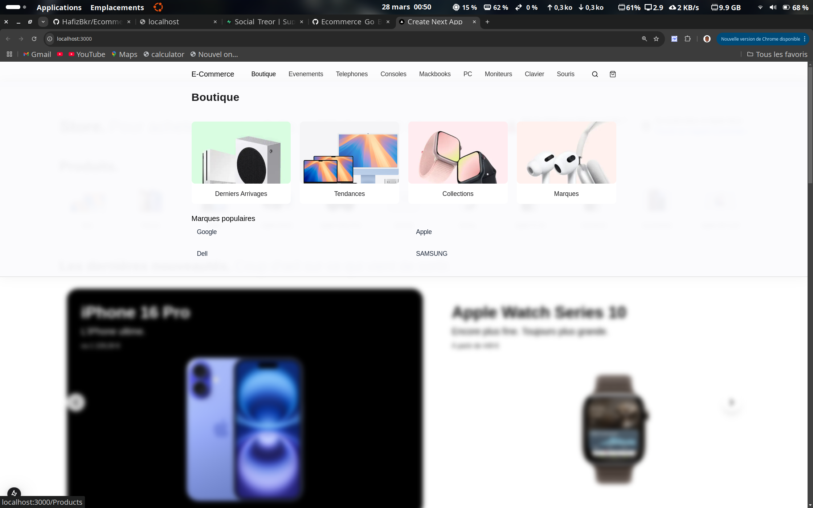
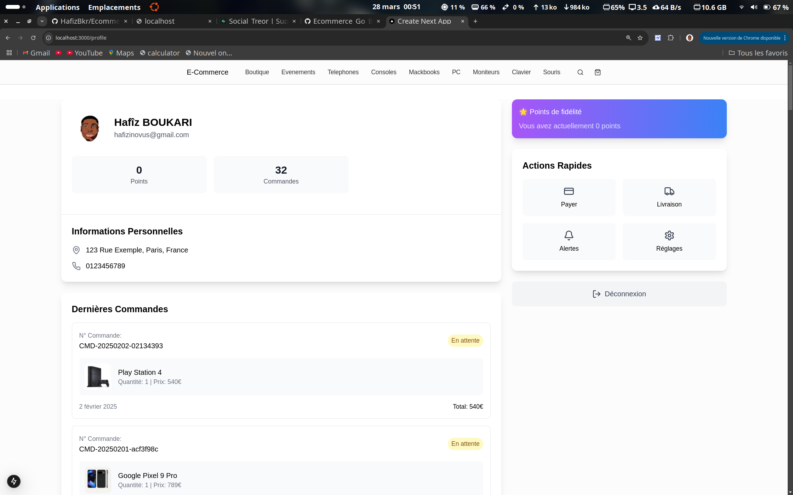

# Documentation du Frontend du Projet E-Commerce

Voici quelques captures d'écran montrant l'interface du projet.

### Page d'accueil




### Panier


### Profil


### Produit


### Boutique


### Events


## Introduction
Ce projet est l'interface utilisateur d'une plateforme e-commerce développée avec **Next.js** et **TypeScript**. Il communique avec le backend disponible à l'adresse suivante : [Ecommerce Go Backend](https://github.com/HafizBkr/Ecommerce_Go_Back-end).

## Technologies Utilisées
- **Next.js** (React Framework)
- **TypeScript**
- **Tailwind CSS** (pour le stylisme)
- **PostCSS**
- **ESLint** (pour le linting)
- **API REST** pour l'interaction avec le backend

## Structure du Projet

### Racine du projet
- `env.exemple` : Exemple de fichier d'environnement.
- `package.json` et `package-lock.json` : Gestion des dépendances.
- `next.config.ts` : Configuration de Next.js.
- `tsconfig.json` : Configuration TypeScript.
- `README.md` : Documentation principale.

### Répertoires Principaux

#### **`context/`**
- `AuthContext.ts` : Contexte d'authentification pour gérer l'état de l'utilisateur.

#### **`lib/`**
- `api.ts` : Gestion des appels API vers le backend.
- `utils.ts` : Fonctions utilitaires globales.

#### **`pages/`**
Contient les différentes pages de l'application :
- `categories/[categoryId].tsx` : Page d'affichage des produits par catégorie.
- `SingleProductPage/[productId].tsx` : Détails d'un produit.
- `complete-profile.tsx` : Page pour compléter le profil utilisateur.
- `api/upload.ts` : API interne pour le téléchargement de fichiers.

#### **`src/app/`**
- **`components/`** : Composants réutilisables de l'application.
  - `Navbar.tsx`, `Footer.tsx` : En-tête et pied de page.
  - `Panier/Panier.tsx` : Gestion du panier.
  - `Products/SingleProduct.tsx` : Affichage d'un produit spécifique.
  - `auth/` : Composants liés à l'authentification (`login.tsx`, `register.tsx`).
  - `Dashboard/` : Interface administrateur avec gestion des catégories, produits et commandes.
  - `ui/` : Composants génériques (boutons, cartes, inputs, etc.).

#### **`hooks/`**
- `useAuth.ts` : Gestion de l'authentification.
- `useCategories.ts` : Récupération des catégories depuis l'API.
- `usePanier.ts` : Gestion du panier utilisateur.
- `useSearch.ts` : Gestion de la recherche de produits.

#### **`styles/`**
- `Home.module.css`, `Navbar.module.css`, `Footer.module.css` : Fichiers CSS modulaires.

#### **`public/`**
Contient les ressources statiques (images, vidéos, icônes, etc.).

## Installation et Configuration
### Prérequis
- Node.js >= 16
- npm ou yarn

### Installation
1. Cloner le dépôt :
   ```sh
   git clone <URL_DU_DEPOT>
   cd front
   ```
2. Installer les dépendances :
   ```sh
   npm install
   ```
3. Copier le fichier d'environnement :
   ```sh
   cp env.exemple .env.local
   ```
   Modifier `.env.local` avec les variables nécessaires.

4. Lancer le projet en mode développement :
   ```sh
   npm run dev
   ```

5. Accéder à l'application sur `http://localhost:3000`

## Fonctionnalités Principales
- **Inscription & Connexion** (Google Auth, Email/Password)
- **Affichage des produits** par catégorie et recherche dynamique
- **Gestion du panier** (ajout, suppression, modification)
- **Passage de commande** et suivi des commandes
- **Interface administrateur** pour la gestion des produits et commandes
- **Gestion des événements** pour des promotions spéciales
- **Système de favoris** pour enregistrer des produits préférés

## Contribution
1. Créer une branche :
   ```sh
   git checkout -b feature-nouvelle-fonctionnalite
   ```
2. Faire les modifications et commit :
   ```sh
   git commit -m "Ajout de la fonctionnalité X"
   ```
3. Pousser la branche :
   ```sh
   git push origin feature-nouvelle-fonctionnalite
   ```
4. Ouvrir une pull request sur GitHub.

## Déploiement
L'application peut être déployée sur **Vercel** ou **Netlify** en pushant simplement la branche `main` sur GitHub.

## Contact & Support
Pour toute question ou problème, contacter [hafizinovus@gmail.com](mailto:hafizinovus@gmail.com).
